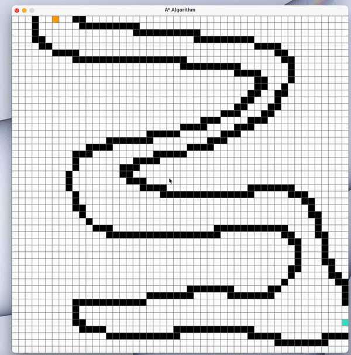

# A* Pathfinding Algorithm Visualizer

This project is a visual representation of the **A*** pathfinding algorithm built with **Pygame**. It allows users to interactively set start and end points, place obstacles, and watch the algorithm find the shortest path.

## Features

- **Interactive Visualization**: Place starting and ending points, as well as barriers, on a grid.
- **Real-Time Algorithm Execution**: See the algorithm in action as it calculates the shortest path.
- **Dynamic Updates**: Reset the grid or rerun the algorithm at any time.
- **Customizable Grid Size**: Grid size is adjustable by modifying the `ROWS` parameter in the code.

## How to Use

1. **Run the Program**: Start the application by running the script:
   ```bash
   python main.py
   ```

2. **Set Points**:
   - **Left-click**:
     - First click sets the **start point** (orange square).
     - Second click sets the **end point** (turquoise square).
     - Subsequent clicks add **barriers** (black squares).
   - **Right-click**: Remove any point or barrier.

3. **Run the Algorithm**:
   - Press the `Spacebar` to start the A* pathfinding algorithm.
   - The algorithm will find the shortest path from the start to the end (if possible).

4. **Reset the Grid**:
   - Press the `C` key to clear the grid and start over.

## Requirements

- Python 3.9 or newer
- Pygame library

### Install Dependencies
Install Pygame using pip:
```bash
pip install pygame
```

## Code Overview

### Main Components

1. **Grid and Spot Class**:
   - Represents the grid and individual cells (spots) within the grid.
   - Handles cell properties like color, neighbors, and barriers.

2. **A* Algorithm**:
   - Calculates the shortest path using a priority queue and heuristic function (Manhattan distance).

3. **Visualization**:
   - Dynamically updates the grid to display the current state of the algorithm.

### Key Functions
- `make_grid(rows, width)`: Initializes the grid.
- `draw(win, grid, rows, width)`: Draws the grid and updates the display.
- `algorithm(draw, grid, start, end)`: Executes the A* pathfinding algorithm.
- `reconstruct_path(came_from, current, draw)`: Traces back the shortest path once the endpoint is reached.

## Customization

- **Grid Size**: Change the number of rows in the grid by modifying the `ROWS` variable in the `main()` function.
- **Window Size**: Update the `WIDTH` variable to adjust the size of the application window.

## Rust Version (In Progress)

A Rust version of this A* Pathfinding Algorithm Visualizer is currently being developed but is not yet completed. Stay tuned for updates!

## Screenshots


## Acknowledgements

- Inspired by common A* visualization tools.
- Built with Pygame for real-time interactivity.

## License

This project is licensed under the MIT License. Feel free to use and modify the code as you see fit.

---

Enjoy exploring the A* algorithm with this interactive tool!
